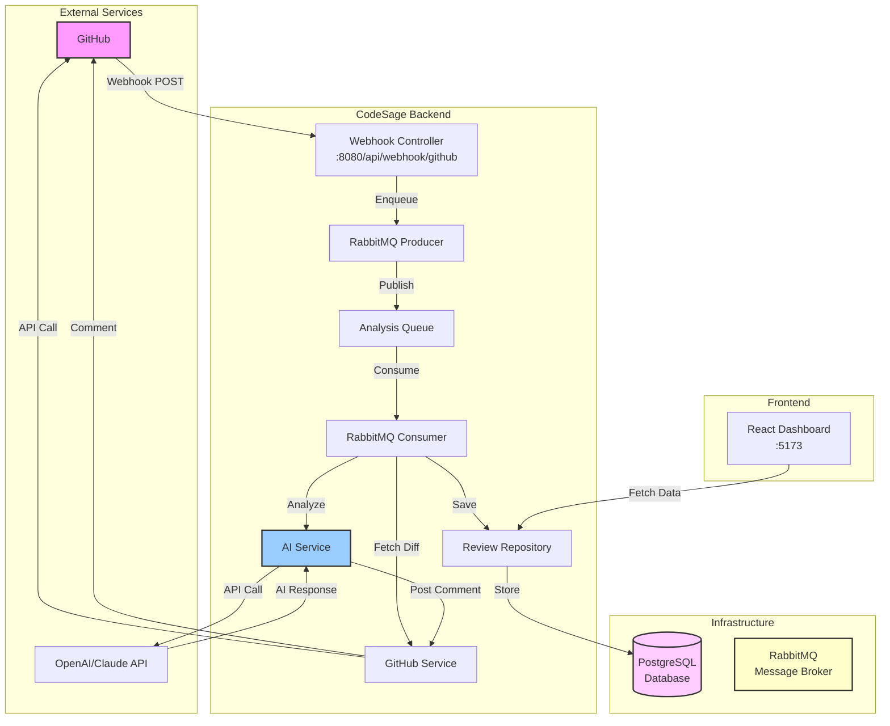

# CodeSage 🧙‍♂️

<div align="center">

**AI-Powered Code Review Assistant for GitHub Pull Requests**

[](https://openjdk.org/)
[](https://spring.io/projects/spring-boot)
[](https://react.dev/)
[](https://www.postgresql.org/)
[](https://www.docker.com/)
[](LICENSE)

*Automate code reviews with AI - catch bugs, improve quality, and maintain best practices effortlessly.*

[Features](#-features) • [Architecture](#-architecture) • [Quick Start](#-quick-start) • [Documentation](#-documentation)

</div>

---

## 🎯 Overview

CodeSage is a **production-ready** AI code review automation platform that integrates with GitHub to provide instant, intelligent feedback on Pull Requests.

### Why CodeSage?

**The Problem:**
- Manual code reviews are time-consuming and inconsistent
- Junior developers don't get timely feedback
- Security vulnerabilities slip through during busy periods
- Best practices aren't enforced uniformly

**The Solution:**
- ✅ **Instant Reviews** - AI analysis within seconds of PR creation
- ✅ **Consistent Quality** - Every PR gets the same thorough review
- ✅ **Learning Tool** - Developers improve from AI suggestions
- ✅ **Focus on What Matters** - Seniors review architecture, AI handles syntax

---

## ✨ Key Features

### 🤖 **AI-Powered Analysis**
- **Multi-Provider Support**: OpenAI GPT-4 with Claude fallback
- **Comprehensive Checks**: Security, performance, bugs, code quality, documentation
- **Structured Feedback**: Categorized by severity (Critical → Info)
- **Actionable Suggestions**: Specific recommendations for fixes

### 🔗 **GitHub Integration**
- **Automatic Webhooks**: Triggers on PR creation/update
- **GitHub App Authentication**: Secure JWT-based auth
- **Direct PR Comments**: AI posts formatted reviews as comments
- **Repository Flexibility**: Works across multiple repos

### 📊 **Analytics Dashboard**
- **Real-time Metrics**: Quality scores, issue counts, active PRs
- **Historical Tracking**: Review history and trends
- **Issue Breakdown**: By type and severity
- **Live Updates**: Auto-refresh every 30 seconds

### 🔄 **Asynchronous Processing**
- **RabbitMQ Queue**: Non-blocking webhook responses
- **Scalable Architecture**: Handles high PR volumes
- **Retry Logic**: Exponential backoff for resilience
- **Error Recovery**: Graceful failure handling

---

## 🏗️ Architecture



### Technology Stack

| Component | Technology | Purpose |
|-----------|-----------|---------|
| **Backend** | Spring Boot 3.2 + WebFlux | RESTful API, async HTTP calls |
| **Frontend** | React 18 + Vite | Modern dashboard UI |
| **Database** | PostgreSQL 15 | Persistent data storage |
| **Message Queue** | RabbitMQ 3 | Asynchronous event processing |
| **AI Engine** | OpenAI GPT-4 / Claude | Code analysis |
| **Authentication** | JWT (jjwt) | GitHub App authentication |
| **Containerization** | Docker + Docker Compose | Deployment |
| **CI/CD** | GitHub Actions | Automated testing & builds |

---

## 🚀 Quick Start

### Prerequisites

- Java 17+
- Node.js 18+
- Docker & Docker Compose
- OpenAI or Claude API key

### 1. Clone & Configure

```bash
git clone https://github.com/albonidrizi/CodeSage.git
cd CodeSage

# Copy environment template
cp .env.example .env

# Edit .env with your API keys
nano .env
```

### 2. Start with Docker

```bash
# Start all services (PostgreSQL, RabbitMQ, Backend, Frontend)
docker-compose up -d

# View logs
docker-compose logs -f
```

### 3. Access the Application

- **Dashboard**: http://localhost:80
- **Backend API**: http://localhost:8080/api/reviews/health
- **RabbitMQ Management**: http://localhost:15672 (guest/guest)

> **💡 Development Mode**: The frontend automatically displays demo data when the backend is not available. This allows you to preview the UI without setting up the full infrastructure. To connect to the real backend, ensure PostgreSQL and RabbitMQ are running.

### 4. Test Locally

```powershell
# Send test webhook
Invoke-WebRequest -Uri "http://localhost:8080/api/webhook/github" `
  -Method POST `
  -Headers @{"X-GitHub-Event"="pull_request"} `
  -ContentType "application/json" `
  -Body '{"action":"opened","pull_request":{"number":1,"title":"Test PR"}}'
```

---

## 📚 Documentation

### Setup Guides
- **[GitHub Integration](docs/github-integration.md)** - Set up GitHub App for real PR reviews
- **[Deployment Guide](docs/deployment.md)** - Deploy to Railway, Render, or VPS

### API Documentation

#### REST Endpoints

```http
GET  /api/reviews              # List all reviews (paginated)
GET  /api/reviews/{id}         # Get specific review
GET  /api/reviews/repo/{owner}/{name}  # Reviews for repository
GET  /api/reviews/recent       # Last 7 days
GET  /api/reviews/stats        # Dashboard statistics
GET  /api/reviews/health       # Health check
```

#### Example Response

```json
{
  "id": 1,
  "repositoryOwner": "yourusername",
  "repositoryName": "your-repo",
  "prNumber": 42,
  "prTitle": "Add new feature",
  "qualityScore": 8.5,
  "status": "COMPLETED",
  "issues": [
    {
      "type": "SECURITY",
      "severity": "HIGH",
      "title": "Potential SQL Injection",
      "description": "User input concatenated in SQL query",
      "suggestion": "Use PreparedStatement with parameterized queries",
      "filePath": "src/main/java/Example.java",
      "lineNumber": 42
    }
  ]
}
```

---

## 🛠️ Development

### Project Structure

```
CodeSage/
├── backend/                    # Spring Boot application
│   ├── src/main/java/com/codesage/
│   │   ├── controller/         # REST controllers
│   │   ├── service/            # Business logic (AI, GitHub)
│   │   ├── model/              # JPA entities
│   │   ├── repository/         # Data access
│   │   ├── queue/              # RabbitMQ consumers
│   │   └── exception/          # Error handling
│   └── Dockerfile
├── frontend/                   # React application
│   ├── src/
│   │   ├── services/           # API client
│   │   ├── App.jsx            # Main dashboard
│   │   └── App.css            # Styles
│   ├── Dockerfile
│   └── nginx.conf
├── docs/                       # Documentation
├── .github/workflows/          # CI/CD pipeline
└── docker-compose.yml          # Multi-service setup
```

### Local Development

```bash
# Backend (without Docker)
cd backend
mvn spring-boot:run

# Frontend (without Docker)
cd frontend
npm install
npm run dev
```

### Running Tests

```bash
# Backend tests
cd backend
mvn test

# Generate coverage report
mvn jacoco:report
```

---

## 🚧 Current Status

**Production-Ready Features:**
- ✅ Real AI integration (OpenAI GPT-4 + Claude fallback)
- ✅ GitHub App authentication with JWT
- ✅ Webhook processing with signature verification
- ✅ Asynchronous analysis with RabbitMQ
- ✅ PostgreSQL persistence with analytics
- ✅ Real-time dashboard with auto-refresh
- ✅ CI/CD pipeline with GitHub Actions
- ✅ Docker deployment configuration
- ✅ Comprehensive error handling
- ✅ Health checks and monitoring

**Planned Enhancements:**
- 🔄 Comprehensive test suite (unit + integration)
- 🔄 Live deployment (Railway/Render)
- 🔄 Custom review rules configuration
- 🔄 Multi-repository dashboard
- 🔄 Slack/Discord notifications

---

## 🔒 Security

- **Webhook Signature Verification**: HMAC-SHA256 validation
- **JWT Authentication**: Secure GitHub App integration
- **Environment Variables**: All secrets externalized
- **Non-root Docker Containers**: Security best practices
- **Input Validation**: Spring Boot validation framework
- **CORS Configuration**: Restricted origins in production

---

## 📈 Performance

- **Webhook Response**: < 100ms (async processing)
- **AI Analysis**: 5-15 seconds (depends on code size)
- **Dashboard Load**: < 2 seconds
- **Database Queries**: < 50ms (indexed)
- **Concurrent PRs**: Scales horizontally with RabbitMQ

---

## 🤝 Contributing

Contributions are welcome! Please:

1. Fork the repository
2. Create a feature branch (`git checkout -b feature/amazing-feature`)
3. Commit your changes (`git commit -m 'Add amazing feature'`)
4. Push to the branch (`git push origin feature/amazing-feature`)
5. Open a Pull Request

### Code Style
- **Java**: Google Java Style Guide
- **JavaScript**: ESLint with Airbnb config
- **Commits**: Conventional Commits

---

## 📄 License

This project is licensed under the MIT License - see the [LICENSE](LICENSE) file for details.

---

## 👤 Author

**Albon Idrizi**

- GitHub: [@albonidrizi](https://github.com/albonidrizi)
- LinkedIn: [Albon Idrizi](https://linkedin.com/in/albonidrizi)
- Email: albonidrizi@gmail.com

---

## 🙏 Acknowledgments

- [Spring Boot](https://spring.io/projects/spring-boot) - Excellent Java framework
- [OpenAI](https://openai.com/) & [Anthropic](https://www.anthropic.com/) - AI capabilities
- [React](https://react.dev/) & [Vite](https://vitejs.dev/) - Modern frontend tooling
- [RabbitMQ](https://www.rabbitmq.com/) - Reliable message queuing

---

<div align="center">

**⭐ Star this repository if you find it helpful!**

Made with ❤️ by [Albon Idrizi](https://github.com/albonidrizi)

*Empowering developers with AI-driven code reviews*

</div>
